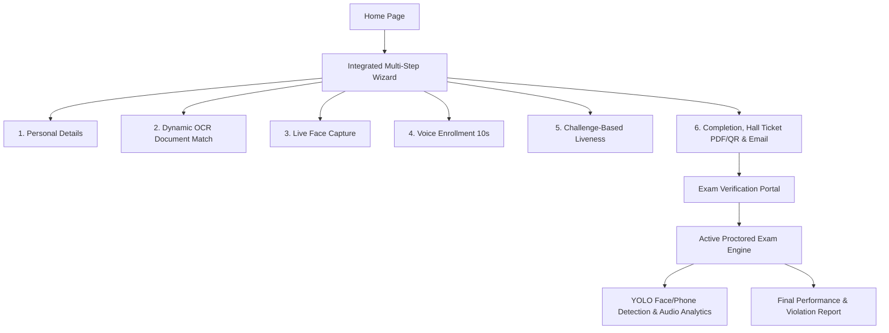

# OmniVerifyX AI — AI-Powered Identity Verification & Exam Integrity Platform

OmniVerifyX AI is a state-of-the-art, fully integrated, AI-powered identity verification and proctored examination platform. The system combines robust OCR document analysis, multi-modal biometrics (Face and Voice), real-time challenge-based liveness verification, and an online exam engine with active YOLO-based proctoring to deliver a highly secure candidate testing experience.

This build is polished, audited, and optimized as an internship submission build for Tekisho Info Tech.

---

## 1. Project Overview & Architecture

OmniVerifyX AI addresses the challenges of identity fraud and academic dishonesty in high-stakes online examinations (both Government and University examinations). The application orchestrates a multi-step identity verification wizard, checks biological liveness, generates printable security hall tickets, and performs active computer vision monitoring during the exam.



---

## 2. Core Features

The system contains the following key modules:

- **Government Exam Portal**: Supports complex workflows verifying Aadhaar details, Caste certificates, and Income bounds for welfare verification.
- **University Exam Portal**: Seamless quiz/examination console containing countdown timers, interactive questions, and instant score compilation.
- **Unified Authentication**: High-fidelity login workspace with role-based tabs (Admin, Candidate, Student) featuring password visibility toggles and password validation checklists.
- **OCR Document Verification**: Automated parser leveraging EasyOCR to extract name, birth dates, document numbers, and financial details from uploaded files.
- **Face Recognition**: Embeddings-based facial similarity verification powered by InsightFace.
- **Voice Biometrics**: Voice signature extraction and verification built on SpeechBrain.
- **AI Liveness Detection**: Real-time liveness validator tracking eye blinks and left/right head movements via MediaPipe Face Mesh.
- **Hall Ticket Generation**: Dynamic, professional printable Admit Card layout containing candidate photographs, secure QR codes, and PDF generation with ReportLab.
- **Admin Dashboard**: Consolidated monitoring hub depicting verification metrics, exam schedules, and a live proctor audit logger.
- **Reports & Analytics**: High-quality analytical widgets constructed using Recharts tracking pass/fail ratios, risk levels, and violation frequencies.
- **AI Proctoring**: YOLOv8-powered computer vision engine analyzing camera feeds for cell phones, multiple faces, voice presence, and browser tab switching.
- **Supabase Integration**: Configurable environment variables for integration with Supabase URL and keys, falling back to SQLite for local development.

---

## 3. Technology Stack

OmniVerifyX AI employs a dual-engine full-stack layout powered by modern open-source libraries and models:

- **React Frontend**: React 19, Vite, Vanilla CSS Design System, Recharts, React Router v7, Axios, React Webcam.
- **FastAPI Backend**: FastAPI (Python 3.8+), SQLite (via SQLAlchemy ORM), Uvicorn.
- **Computer Vision (AI)**: YOLOv8 (Ultralytics), MediaPipe Face Mesh, OpenCV.
- **Speech Signature (AI)**: SpeechBrain, WavLM Pretrained Embeddings, SoundFile, Librosa.
- **OCR Engine**: EasyOCR.
- **Reporting & QR Services**: ReportLab PDF, Python-QRcode.

---

## 4. Environment Variables

Create `.env` configuration files in both `backend` and `frontend` directories to customize runtime options.

### Backend Config (`backend/.env`)

```ini
# Supabase Configuration (Optional - Defaults to local SQLite)
SUPABASE_URL=your_supabase_project_url
SUPABASE_ANON_KEY=your_supabase_anon_key
SUPABASE_SERVICE_ROLE_KEY=your_supabase_service_role_key

# JWT Token Configurations
JWT_SECRET_KEY=your_jwt_secret_key_here
JWT_ALGORITHM=HS256

# SMTP Credentials for Email Notifications (Optional)
SMTP_HOST=smtp.gmail.com
SMTP_PORT=587
SMTP_USERNAME=your_email@gmail.com
SMTP_PASSWORD=your_app_password
SMTP_FROM_EMAIL=your_email@gmail.com
```

### Frontend Config (`frontend/.env`)

```ini
VITE_API_BASE_URL=http://localhost:8000
```

---

## 5. Installation & Setup

### Prerequisites
- **Python 3.8+**
- **Node.js 18+**
- **Git**

### Backend Setup

1. Navigate to the backend directory:
   ```bash
   cd backend
   ```
2. Create and activate a virtual environment:
   ```bash
   python -m venv venv
   # Windows
   venv\Scripts\activate
   # macOS/Linux
   source venv/bin/activate
   ```
3. Install dependencies:
   ```bash
   pip install -r requirements.txt
   ```
4. Start the FastAPI server (migrations will execute automatically on startup):
   ```bash
   uvicorn main:app --port 8000
   ```

### Frontend Setup

1. Navigate to the frontend directory:
   ```bash
   cd frontend
   ```
2. Install packages:
   ```bash
   npm install
   ```
3. Run the Vite development server:
   ```bash
   npm run dev -- --port 3000
   ```
4. Open your browser and navigate to `http://localhost:3000`.

---

## 6. Demo Credentials

You can sign in using these default credentials (preloaded on clicking respective role tabs):

*   **Admin Portal**: `admin@omniverifyx.ai` / `password123`
*   **Candidate Workspace**: `candidate@omniverifyx.ai` / `password123`
*   **Student Exam Desk**: `student@omniverifyx.ai` / `password123`

---

## 7. Screenshots Section Placeholders

Below are sections representing screenshots of the running platform:

### 1. Unified Authentication Workspace
*Placeholder: Screenshot of the multi-tab login system for Admin, Candidate, and Student.*

### 2. Multi-Step Biometric Wizard
*Placeholder: Screenshots of the step-by-step Face enrollment, Voice recording, and MediaPipe liveness test.*

### 3. Smart OCR Identity Checker
*Placeholder: Interface displaying extraction progress bars and matched Aadhaar, Caste, and Income credentials.*

### 4. Active YOLOv8 Proctoring Console
*Placeholder: Quiz dashboard with a live video feed displaying detection bounding boxes and proctor violations.*

### 5. Recharts Analytics Hub
*Placeholder: Admin panel displaying the violation metrics, audit logs, and risk assessments.*

---

## 8. Future Roadmap

1. **GPU Acceleration**: Deploy CUDA-based multi-threading for EasyOCR and YOLOv8 pipeline optimizations.
2. **Lockdown Client Browser**: OS-level browser lockdowns to prevent virtual machine or multi-monitor emulation.
3. **P2P Offline Examinations**: Support LAN-based exams for low-connectivity environments with asynchronous cloud syncing.

---

## 9. License

This project is licensed under the MIT License. See the [LICENSE](LICENSE) file for more details.
